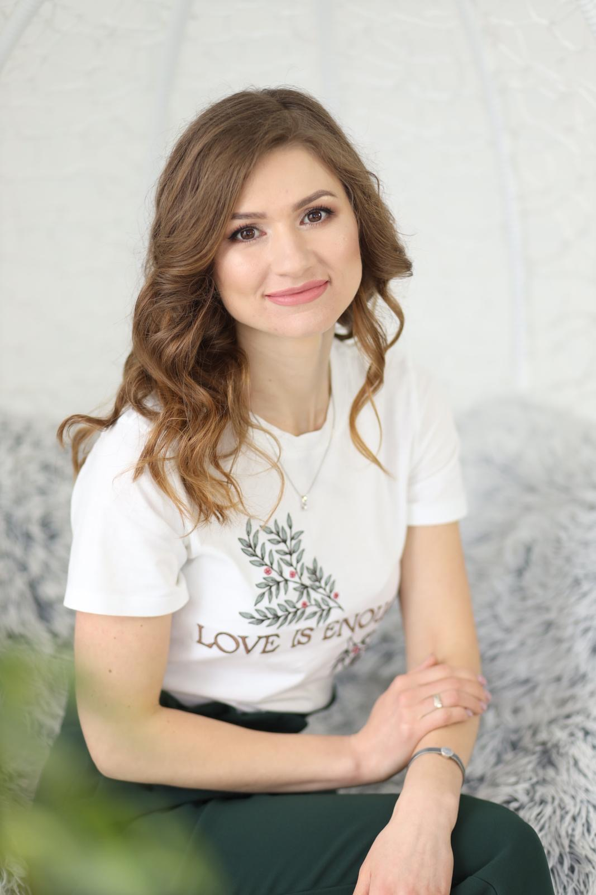

# Om meg selv

**Hei alle**,

Jeg heter Kateryna. Jeg kom til Norge for to år siden fra Ukraina. Jeg er 35 år gammel. Jeg er gift og har to barn. Jeg har høyere utdanning fra Ukraina. Spesialisering min er **Datasystemer og nettverk. 

For noen år siden jobbet jeg som *release manager i et IT-selskap som utviklet systemer for å lage design for kjøkken og bad. I fjor studerte jeg Java. Jeg vil prøve meg som utvikler i Java, men jeg er ikke ferdig med det ennå. Jeg vil komme tilbake til det senere. 
Jeg startet nylig et QA Engineering-kurs, og jeg er ferdig med det nå. Jeg vil utvikle meg i IT-retningen og åpne for nye muligheter. 

I fritiden liker jeg å gå på tur. Jeg trives i Norge, spesielt å være på vakre steder; det er så mye vakkert i Norge. Jeg liker også å trene, å lese bøker (for eksempel om psykologi). 

Jeg liker å lære nye ting, oppdage en ny side av meg selv, kommunisere med mennesker og tilbringe kvalitetstid med venner og familien min.

Nå er jeg på introduksjonprogram fra NAV. Jeg går på norskkurs og jeg liker å lære norsk. Jeg er også veldig glad at jeg har muligheten å jobbe med dere i team. Håper jeg kan bli nyttig.

{: style="width: 500px; height: auto;" }

